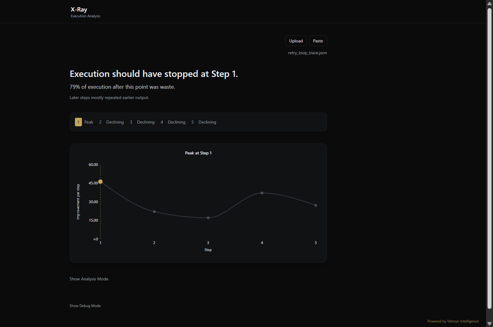

# X-Ray

Deterministic. Lexical. Bounded.

X-Ray is a deterministic execution-analysis engine for multi-step LLM workflows.

It analyzes execution traces to determine:

- whether a run forms a valid evolving execution trajectory
- where structural contribution peaks
- where execution transitions from structural contribution into repetition or redundancy

> X-Ray analyzes execution structure, not semantic correctness.
>
> Status: Beta (v0.1.0)
>
> Core execution analysis behavior and fail-safe boundaries are stable.
> Interpretation and visualization layers may evolve across minor versions.



## Why Execution Analysis Exists

Multi-step AI systems often continue executing after structural contribution has already peaked.

Additional execution may:

- repeat earlier work
- increase token cost without adding signal
- drift across tasks
- create apparent progress without structural change

Most systems constrain execution using:

- retry limits
- budget ceilings
- step caps
- timeout policies

But these mechanisms do not evaluate whether execution is still producing structural contribution.

X-Ray analyzes the execution trajectory itself.

---

## Example Behaviors

Valid execution:

```json
[
  {"output": "sort descending"},
  {"output": "use reverse=True"}
]
```

Invalid execution:

```json
[
  {"output": "capital of france"},
  {"output": "capital of germany"}
]
```

The first represents operational refinement.

The second represents independent topical fragments rather than a continuous execution trajectory.

---

## Example Trace

```json
[
  {"output": "Explain transformers simply"},
  {"output": "Expand explanation"},
  {"output": "Add technical detail"},
  {"output": "Add examples"},
  {"output": "Continue expanding"}
]
```

## Real Workflow Replay

Example replay of a real CrewAI multi-agent workflow analyzed through X-Ray.


## What X-Ray Does

X-Ray provides:

- execution validity enforcement
- trajectory continuity analysis
- redundancy visibility
- execution transition detection
- deterministic execution analysis

Valid executions may produce:

- peak-step detection
- waste estimation
- execution timelines
- structural contribution analysis

Invalid executions terminate in fail-safe mode and do not expose:

- trajectory analysis
- plots
- contribution signals
- internal metrics

---

## Real Workflow Examples

The repository includes deterministic replay fixtures and provider-backed workflow captures from:

- OpenAI iterative refinement workflows
- Claude refinement traces
- LangChain runnable chains
- LangChain official workflow patterns
- CrewAI multi-agent workflows

Examples are stored as replayable execution traces and analyzed locally through the packaged SDK.

See:

- [LangChain official examples](examples/langchain_official/)
- [CrewAI official examples](examples/crewai_official/)
- [Claude refinement example](examples/claude_refinement/)
- [Retry loop examples](examples/retry_loops/)

Some live-provider example outputs may drift over time as upstream model behavior changes.
Committed replay fixtures remain deterministic once captured.

## Deterministic Replay

Committed workflow fixtures replay locally without live provider calls.

Live capture scripts are optional and provider-specific.

Once captured, traces replay deterministically through the SDK, CLI, and UI.

---

## Design Principles

X-Ray is:

- deterministic  
  the same input and algorithm versions produce identical output

- lexical  
  continuity and redundancy are based on token-level overlap

- bounded  
  invalid execution returns fail-safe instead of speculative analysis

- infrastructure-oriented  
  designed for reproducible execution analysis and integration

X-Ray is not:

- a semantic reasoning system
- an embeddings-based analyzer
- an LLM evaluator
- a correctness scoring system
- an agent framework
- a workflow orchestrator

---

## Install

```bash
pip install veloryn-xray
```

Editable local install:

```bash
pip install -e xray
```

## SDK

```python
from veloryn.xray import analyze_structured, analyze_raw
```

The SDK surface is intentionally minimal and deterministic.

---

## Quick Start

```python
from veloryn.xray import analyze_structured

data = {
    "steps": [
        {"output": "sort descending"},
        {"output": "use reverse=True"},
    ]
}

result = analyze_structured(data)

if result.is_valid:
    print(result.verdict.peak_step)
    print(result.verdict.waste_percentage)
    print(result.summary.reason)
else:
    print(result.verdict.message)
```

---

## Why Lexical Instead of Semantic

X-Ray intentionally avoids embeddings, semantic similarity, and LLM-based interpretation.

This preserves:

- determinism
- reproducibility
- stable SDK contracts
- explainable execution boundaries

---

## Determinism

X-Ray uses no randomness, no embeddings, no semantic model, and no LLM calls.

For the same input and same algorithm versions, output is stable.

See [docs/determinism.md](docs/determinism.md).

## Documentation

- [Architecture](docs/architecture.md)
- [Engine Flow](docs/engine_flow.md)
- [Execution Validity](docs/execution_validity.md)
- [Fail-Safe Contract](docs/failsafe_contract.md)
- [SDK Contract](docs/sdk_contract.md)
- [Determinism](docs/determinism.md)
- [Invariants](docs/invariants.md)
- [Versioning](docs/versioning.md)
- [Testing](docs/testing.md)
- [Limitations](docs/limitations.md)
- [Philosophy](docs/philosophy.md)

---

## License

Copyright (c) 2026 Veloryn Intelligence

Licensed under the Apache License, Version 2.0.
