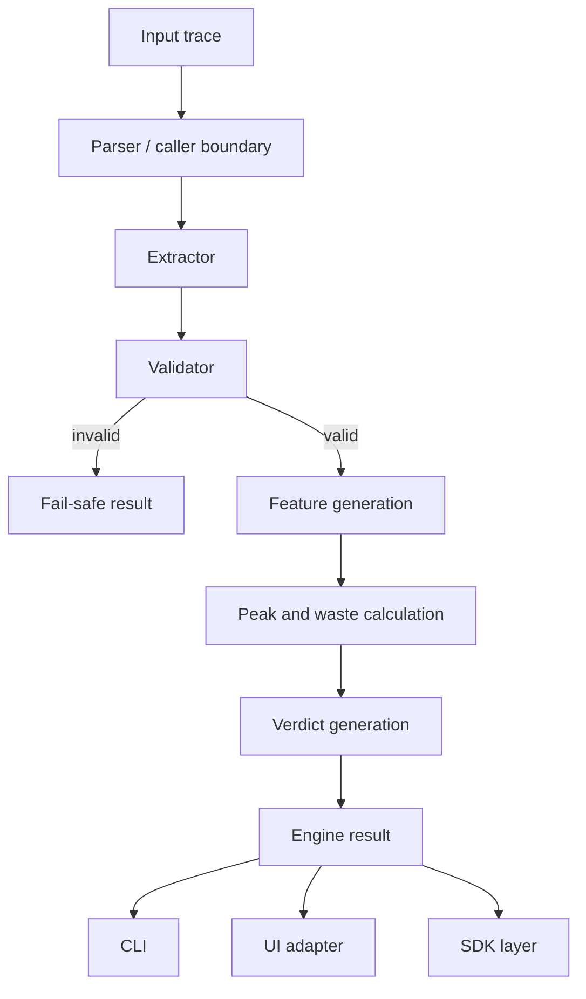

# Architecture

X-Ray is organized as a deterministic execution-analysis pipeline with separate SDK, engine, CLI, UI adapter, and frontend layers.

## Component Boundaries



## Engine

The public SDK lives in `veloryn.xray`. The engine lives in `pattern_extractor`.

### Parser / Caller Boundary

Current packaged SDK:

- `veloryn.xray.analyze_structured`
- `veloryn.xray.analyze_raw`

The SDK exposes a strict structured boundary and a raw parsing boundary.

- `analyze_structured` accepts a top-level `dict` with `steps`
- `analyze_raw` accepts raw text or JSON text

The underlying engine accepts top-level list input and rejects invalid top-level structures with `ValueError`.

The UI adapter has its own parser in `ui_adapter/analyze.py::parse_logs`.

### Extractor

Implementation:

- `pattern_extractor/extractor.py`

Responsibilities:

- normalize flat step lists into a single task
- enforce task/step structural handling
- use array order as canonical execution order
- compute token counts
- compute RF and contribution inputs
- call validation before trajectory analysis
- return fail-safe for invalid execution

Explicit `step` values are preserved as metadata when present but are not used for ordering.

### Validator

Implementation:

- `pattern_extractor/validator.py`

Responsibilities:

- compute lexical content overlap
- suppress stopwords and structural continuity tokens
- apply deterministic continuity boundaries
- reject fully discontinuous or structural-only short runs
- detect lexical context-shift patterns

The validator is lexical only. It does not call semantic models.

### Features

Implementation:

- `pattern_extractor/features.py`

Responsibilities:

- tokenization
- overlap ratio
- contribution calculation
- contribution normalization
- smoothing
- peak index selection helpers
- waste-supporting calculations

Peak selection uses a stabilized selector trajectory rather than raw normalized contributions directly. The selector surface includes an early-step stabilization rule so short or front-loaded runs do not default to Step 1 too aggressively.

This means the highest visible contribution value is not always the direct selector basis. The selector is designed to reduce isolated spikes, stabilize early trajectory interpretation, and favor sustained contribution continuity across adjacent steps.

### Classifier

Implementation:

- `pattern_extractor/classifier.py`

Responsibilities:

- assign a deterministic `pattern_type` for valid executions

### Verdict

Implementation:

- `pattern_extractor/verdict.py`

Responsibilities:

- build valid-output text fields
- build timeline labels
- build fail-safe result fields
- render CLI-friendly output
- isolate invalid execution output

## CLI

Implementation:

- `cli/main.py`

Responsibilities:

- read JSON files
- call `extract_patterns`
- render default output
- render analysis/debug output for valid executions
- save `analysis/plot.png` for valid executions with `--plot`
- render fail-safe only for invalid executions in all modes

## UI Adapter

Implementation:

- `ui_adapter/analyze.py`

Responsibilities:

- parse stdin JSON
- call `extract_patterns`
- convert engine output into UI display payloads
- isolate invalid display payloads
- return generic JSON error for adapter exceptions

## Frontend UI

Implementation:

- `src/pages/Home.jsx`
- `src/components/*`

Responsibilities:

- collect upload or pasted input
- call `/api/analyze`
- render valid verdict, timeline, graph, analysis, and debug panels
- render invalid fail-safe state without graph or debug/analysis panels

UI graphs are selector-aligned. They are rendered to match the final selected peak rather than exposing selector-internal surfaces directly.

## SDK Layer

The SDK layer in `veloryn/xray` wraps the engine without changing engine semantics. It preserves:

- top-level schema errors as programming errors
- invalid execution as fail-safe results
- deterministic output behavior
- fail-safe isolation

The SDK exposes the final selected peak outcome, not selector-surface internals.

## Runtime Execution Flow

```text
                ┌──────────────┐
                │ Input Trace  │
                └──────┬───────┘
                       ↓
                ┌──────────────┐
                │ Parser       │
                └──────┬───────┘
                       ↓
          ┌────────────────────────┐
          │ Continuity Validation  │
          └──────┬─────────┬───────┘
                 │         │
         valid   ↓         ↓ invalid
          ┌────────────┐   ┌────────────┐
          │ Feature    │   │ Fail-Safe  │
          │ Extraction │   │ Termination│
          └─────┬──────┘   └────────────┘
                ↓
        ┌──────────────┐
        │ Peak / Waste │
        │ Analysis     │
        └──────┬───────┘
               ↓
        ┌──────────────┐
        │ Verdict      │
        │ Timeline     │
        └──────┬───────┘
               ↓
      ┌──────────────────┐
      │ SDK / CLI / UI   │
      └──────────────────┘
```