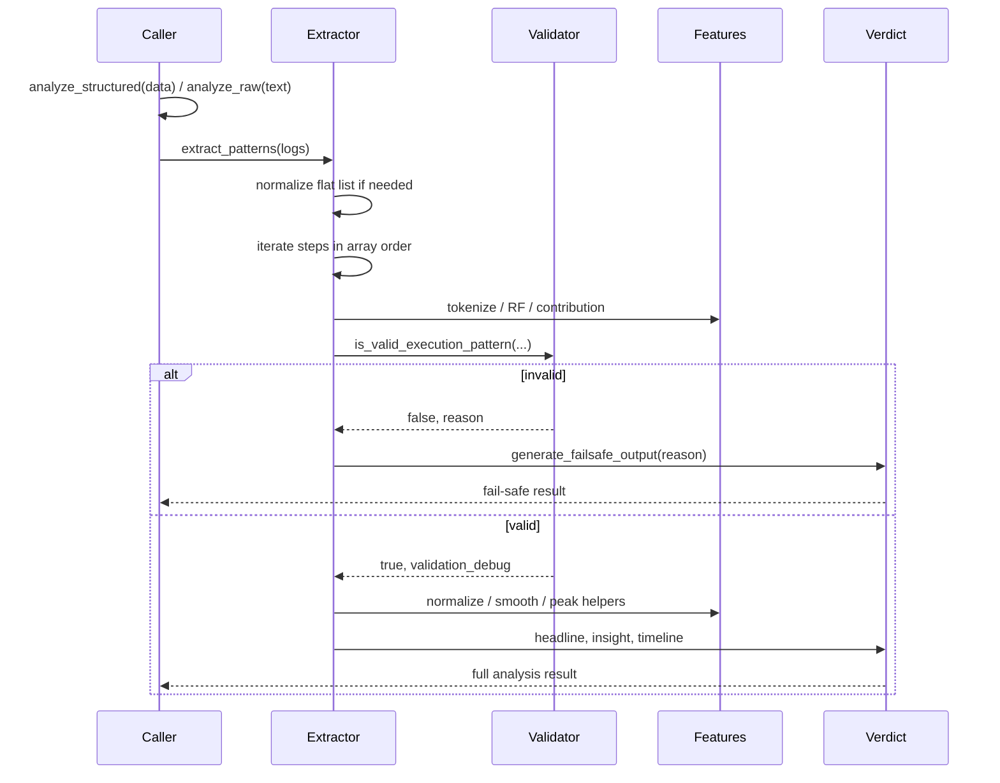

# Engine Flow

This document describes the exact execution flow for X-Ray.

## Input

The packaged SDK entry points are:

```python
from veloryn.xray import analyze_raw, analyze_structured
```

Accepted SDK input:

- structured `{"steps": [...]}` dictionaries
- raw text or JSON text

Structured input rejects:

- missing `steps`
- non-list `steps`
- non-string step outputs

## Flow Summary



## Step 1: Parsing And Boundary Handling

The SDK first validates or parses its boundary input.

- `analyze_structured`: invalid schema raises `ValueError`
- `analyze_raw`: invalid parse or no execution returns fail-safe

After SDK boundary handling, the engine receives list-shaped input. If the list is a flat list of step objects, it is wrapped as one task.

## Step 2: Extraction

For each task, `_extract_task`:

- reads `steps`
- validates each step object
- requires non-empty string `output`
- assigns canonical step numbers from array order
- preserves original step metadata as `original_step` when present
- tokenizes output
- computes token counts
- computes RF values
- computes raw contribution values

Malformed steps return fail-safe with `invalid_schema`.

Fewer than two extracted steps return fail-safe with `insufficient_data`.

## Step 3: Validation

The extractor calls:

```python
is_valid_execution_pattern(rf_values, contributions, step_outputs)
```

Validation checks lexical continuity only.

Invalid validation reasons include:

- `low_continuity`
- `context_shift`

If validation fails, the engine stops and returns fail-safe.

## Invalid Execution Path

Fail-safe is terminal.

When invalid:

- no normalization result is exposed
- no peak is selected
- no waste is calculated
- no timeline is generated
- no plot is generated
- no debug or analysis signal output is exposed by CLI/UI display paths

Engine fail-safe shape:

```python
{
    "is_valid": False,
    "headline_verdict": "No clear execution pattern detected.",
    "core_insight": "This does not appear to be a single evolving task.",
    "failure_reason": "<reason>",
    "task_id": None
}
```

## Valid Execution Path

When valid, the engine continues:

1. normalize contributions
2. build contribution debug metadata
3. build a stabilized selector trajectory
4. select peak index
5. calculate peak step
6. calculate collapse start
7. calculate efficiency stop
8. calculate waste tokens and waste ratio
9. classify pattern type
10. generate headline, core insight, counterfactual, waste line, and timeline
11. attach validation debug and algorithm versions

## Peak And Waste Mechanics

Peak selection uses a stabilized selector trajectory rather than raw normalized contributions directly.

The engine includes an early-step stabilization rule so Step 1 does not dominate certain front-loaded runs too aggressively.

This means Step 2 may be selected even when Step 1 has a slightly higher raw contribution.

CLI and UI visualizations are selector-aligned so the visible peak matches the final selected outcome. Debug mode intentionally continues to expose raw and normalized contribution values.

Waste is calculated from token counts after the selected peak:

```text
waste_ratio = tokens_after_peak / total_tokens
```

This is deterministic and lexical. It is not a semantic assessment of whether later steps were useful.

## Output

Valid output contains full analysis fields.

Invalid output contains fail-safe fields only.

Display layers may map engine output into CLI or UI-specific payloads, but invalid state remains terminal.
