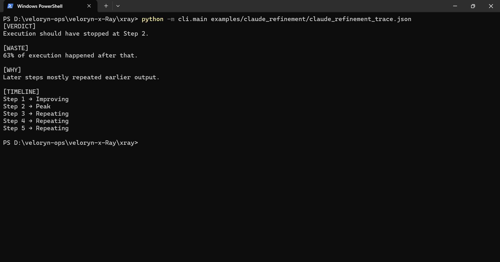
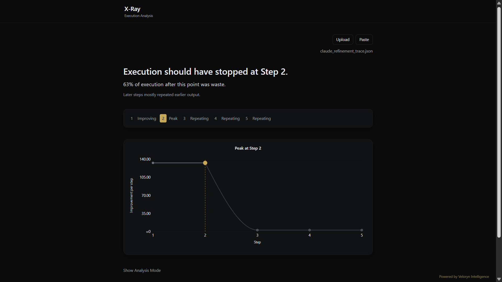

# Claude Refinement Replay

Replay a stored Claude refinement execution trace through X-Ray.

The fixture contains a provider-backed refinement workflow trace captured from a real multi-step Anthropic execution.

## Replay

CLI replay:

```bash
python -m cli.main examples/claude_refinement/claude_refinement_trace.json
```

SDK replay:

```bash
python examples/claude_refinement/claude_refinement.py
```

Optional live-capture regeneration:

```bash
python examples/claude_refinement/generate_claude_example_trace.py
```

Optional fixture verification:

```bash
python examples/claude_refinement/verify_claude_example.py
```

## Execution Pattern

The trace demonstrates a refinement-collapse pattern commonly observed in iterative LLM workflows:

* an initially high-contribution response
* continued local coherence across later stages
* expanding detail without proportional structural progression
* repeated continuation after peak contribution
* declining marginal contribution across later refinement steps

This execution shape commonly appears in:

* iterative refinement workflows
* recursive continuation chains
* critique/revision systems
* expansion-style prompting pipelines
* long-running refinement loops

Example replay verdict:

```text
[VERDICT]
Execution should have stopped at Step 2.

[WASTE]
63% of execution happened after that.

[TIMELINE]
Step 1 → Improving
Step 2 → Peak
Step 3 → Repeating
Step 4 → Repeating
Step 5 → Repeating
```

## CLI Replay Output



## UI Replay Output



The local replay UI visualizes execution trajectories, contribution progression, redundancy growth, and peak-step transitions from deterministic replay traces.

## Trace Artifacts

* `claude_refinement_trace.json`
* `claude_refinement_live_raw.json`

## Related Examples

* `examples/iterative_refinement/`
* `examples/retry_loops/`
* `examples/multi_agent/`
* `examples/langchain_callback/`
* `examples/crewai_callback/`
