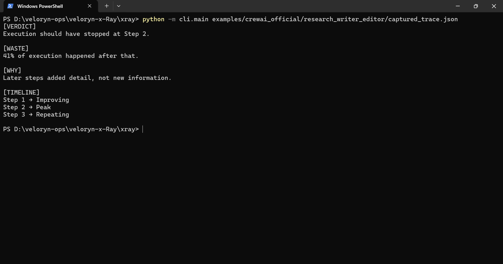
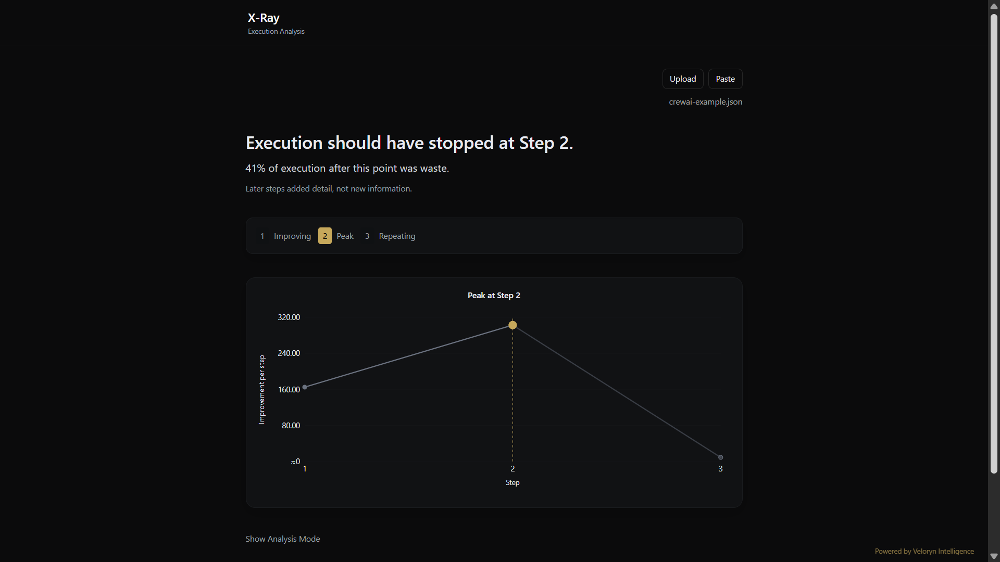

# CrewAI Workflow Replay Examples

Replay deterministic CrewAI execution traces through X-Ray.

These examples demonstrate execution-trajectory analysis on provider-backed multi-agent CrewAI workflows captured from real executions.

Committed traces replay locally once saved and do not require live provider access.

## Included Workflows

- [research_writer_editor](./research_writer_editor/README.md)

## Replay

Run the CrewAI workflow:

```bash
python examples/crewai_official/research_writer_editor/crewai_example.py
```

Replay the stored execution trace through X-Ray:

```bash
python -m cli.main examples/crewai_official/research_writer_editor/captured_trace.json
```

Optional JSON validation:

```bash
python -m json.tool examples/crewai_official/research_writer_editor/captured_trace.json
```

## Execution Pattern

The trace demonstrates a coordination-heavy refinement pattern commonly observed in sequential multi-agent workflows:

- research → generation → revision stage progression
- continued local task completion across agents
- expanding detail during later refinement stages
- declining structural contribution after peak generation
- repeated refinement without proportional execution progression

This execution shape commonly appears in:

- sequential multi-agent pipelines
- writer/editor orchestration systems
- reviewer refinement workflows
- staged content-generation pipelines
- long-running agent coordination systems

Example replay verdict:

```text
[VERDICT]
Execution should have stopped at Step 2.

[WASTE]
41% of execution happened after that.

[TIMELINE]
Step 1 → Improving
Step 2 → Peak
Step 3 → Repeating
```

## CLI Replay Output



## UI Replay Output



The local replay UI visualizes execution trajectories, contribution progression, redundancy growth, and peak-step transitions from deterministic replay traces.

## Trace Artifacts
- `captured_trace.json`
- `xray_analysis.txt`

## Related Examples
- `examples/crewai_callback/`
- `examples/multi_agent/`
- `examples/retry_loops/`
- `examples/langchain_callback/`
