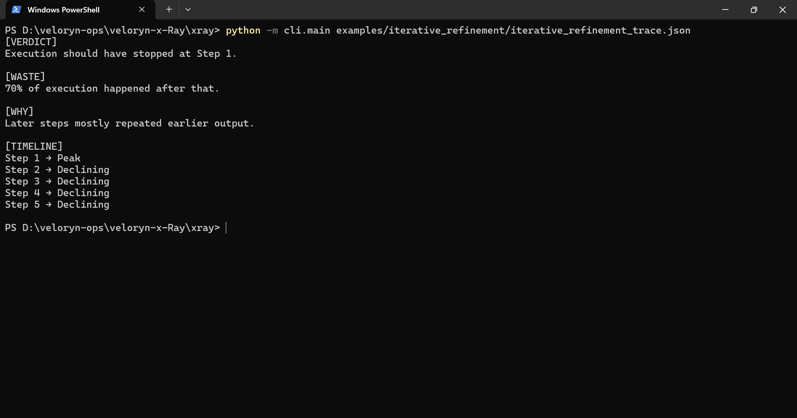
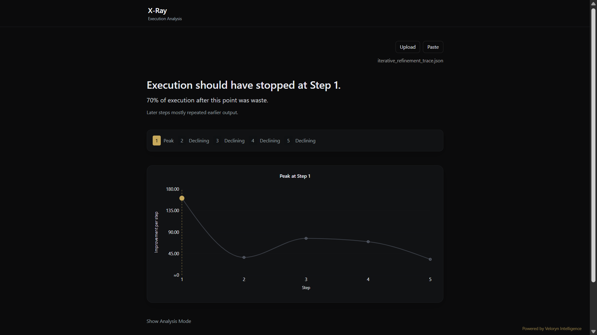

# Iterative Refinement Replay

Replay a stored iterative-refinement execution trace through X-Ray.

The fixture contains a provider-backed refinement workflow trace captured from a real multi-step execution.

## Replay

CLI replay:

```bash
python -m cli.main examples/iterative_refinement/iterative_refinement_trace.json
```

SDK replay:

```bash
python examples/iterative_refinement/iterative_refinement.py
```

Optional live-capture regeneration:

```bash
python examples/iterative_refinement/generate_iterative_refinement_trace.py
```

Optional fixture verification:

```bash
python examples/iterative_refinement/verify_iterative_refinement_example.py
```

## Execution Pattern

The trace demonstrates a refinement-collapse pattern commonly observed in iterative LLM workflows:

- iterative expansion on one evolving topic
- continued local coherence across refinement stages
- increasing detail without proportional structural progression
- repeated reformulation after peak contribution
- declining marginal contribution across later stages

This execution shape commonly appears in:

- iterative refinement chains
- revision-style prompting workflows
- recursive expansion pipelines
- critique/rewrite systems
- long-running refinement loops

Example replay verdict:

```text
[VERDICT]
Execution should have stopped at Step 1.

[WASTE]
70% of execution happened after that.

[TIMELINE]
Step 1 → Peak
Step 2 → Declining
Step 3 → Declining
Step 4 → Declining
Step 5 → Declining
```

## CLI Replay Output



## UI Replay Output



The local replay UI visualizes execution trajectories, contribution progression, redundancy growth, and peak-step transitions from deterministic replay traces.

## Trace Artifacts

* `iterative_refinement_trace.json`
* `iterative_refinement_live_raw.json`

## Related Examples

* `examples/retry_loops/`
* `examples/multi_agent/`
* `examples/langchain_callback/`
* `examples/crewai_callback/`

