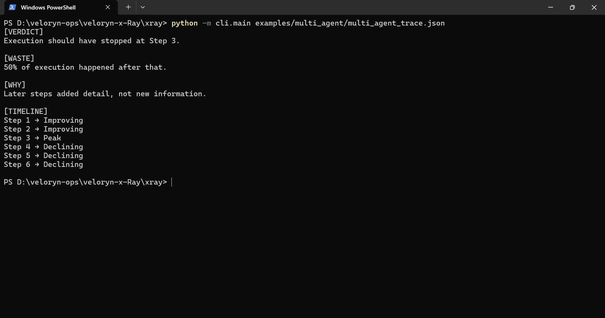
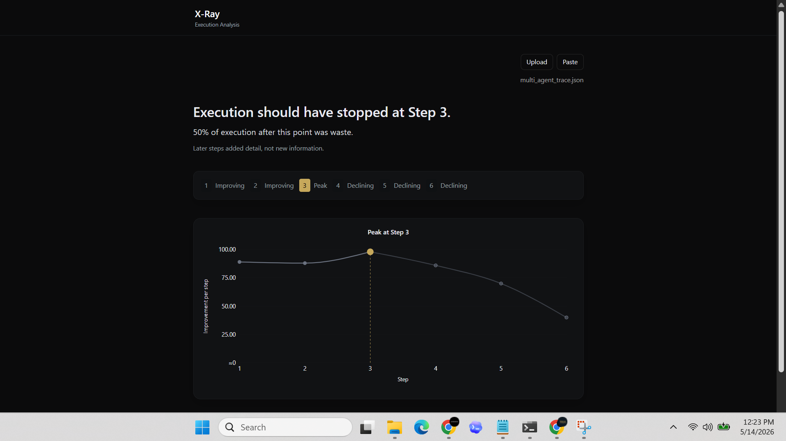

# Multi-Agent Redundancy Replay

Replay a stored multi-agent execution trace through X-Ray.

The fixture contains a provider-backed multi-agent workflow trace captured from a real multi-step execution.

## Replay

CLI replay:

```bash
python -m cli.main examples/multi_agent/multi_agent_trace.json
```

SDK replay:

```bash
python examples/multi_agent/multi_agent_redundancy.py
```

## Execution Pattern

The trace demonstrates a coordination-heavy execution pattern commonly observed in multi-agent workflows:

- planner / executor / reviewer role cycling
- continued local task completion
- expanding coordination overhead
- increasing detail without proportional execution progression
- declining marginal contribution across later stages

This execution shape commonly appears in:

- consensus-style orchestration
- reviewer refinement chains
- planner/executor loops
- recursive agent coordination workflows
- long-running agent systems

Example replay verdict:

```text
[VERDICT]
Execution should have stopped at Step 3.

[WASTE]
50% of execution happened after that.

[TIMELINE]
Step 1 → Improving
Step 2 → Improving
Step 3 → Peak
Step 4 → Declining
Step 5 → Declining
Step 6 → Declining
```

## CLI Replay Output



## UI Replay Output



The local replay UI visualizes execution trajectories, contribution progression, redundancy growth, and peak-step transitions from deterministic replay traces.

## Trace Artifacts

- `multi_agent_trace.json`

## Related Examples

- `examples/retry_loops/`
- `examples/langchain_callback/`
- `examples/crewai_callback/`