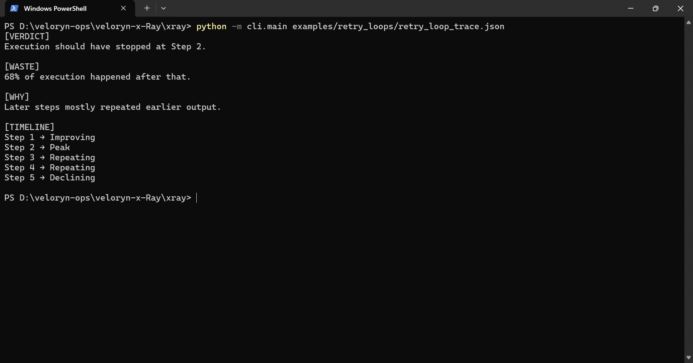
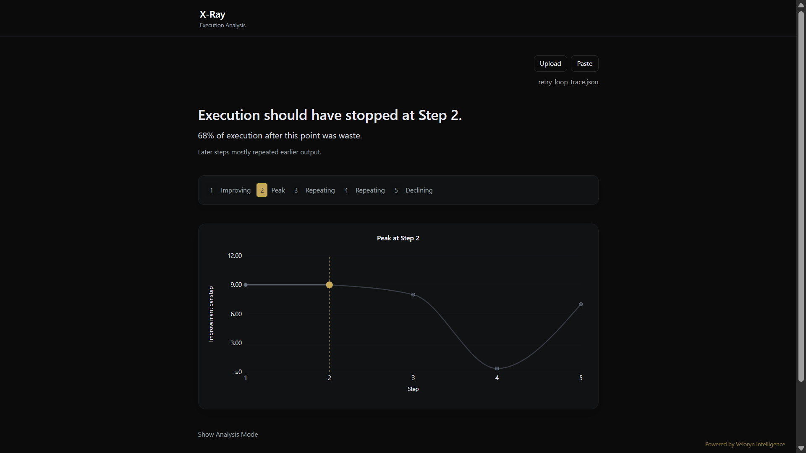

# Retry Loop Replay

Replay a stored retry-loop execution trace through X-Ray.

The fixture contains a provider-backed retry workflow trace captured from a real multi-step execution.

## Replay

CLI replay:

```bash
python -m cli.main examples/retry_loops/retry_loop_trace.json
```

SDK replay:

```bash
python examples/retry_loops/retry_loop.py
```

Optional live-capture regeneration:

```bash
python examples/retry_loops/generate_retry_loop_trace.py
```

Optional fixture verification:

```bash
python examples/retry_loops/verify_retry_loop_example.py
```

## Execution Pattern

The trace demonstrates a retry-collapse pattern commonly observed in multi-step LLM workflows:

- retries continue
- reformulations vary slightly
- execution remains locally coherent
- token usage increases
- marginal contribution declines

This execution shape commonly appears in:

- retry loops
- recursive execution chains
- repeated tool-call workflows
- iterative refinement systems
- long-running agent orchestration

Example replay verdict:

```text
[VERDICT]
Execution should have stopped at Step 2.

[WASTE]
68% of execution happened after peak contribution.

[TIMELINE]
Step 1 → Improving
Step 2 → Peak
Step 3 → Repeating
Step 4 → Repeating
Step 5 → Declining
```

## CLI Replay Output



## UI Replay Output



The local replay UI visualizes execution trajectories, contribution progression, redundancy growth, and peak-step transitions from deterministic replay traces.

## Trace Artifacts

- `retry_loop_trace.json`
- `retry_loop_live_raw.json`

## Related Examples

- `examples/langchain_callback/`
- `examples/crewai_callback/`
- `examples/iterative_refinement/`