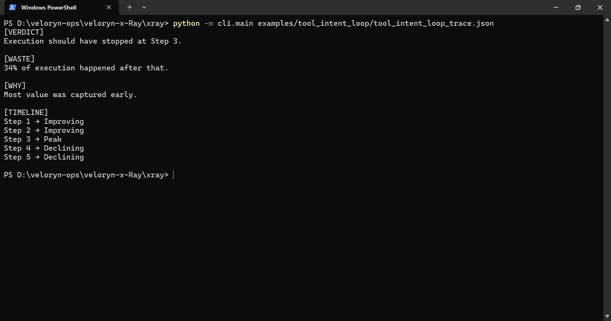
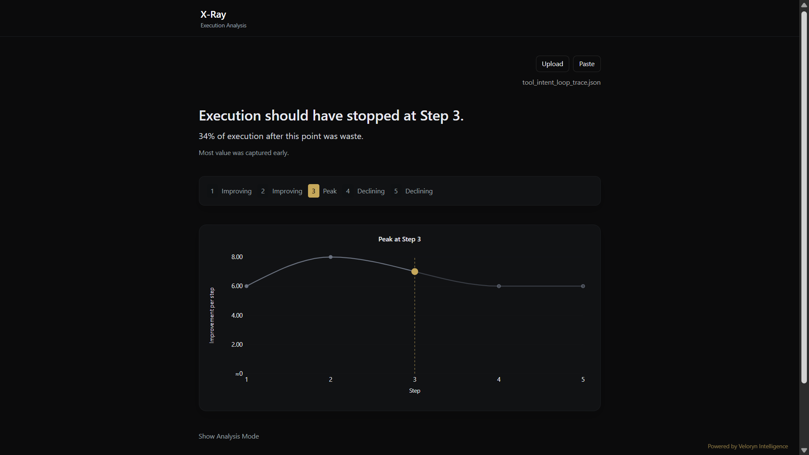

# Tool Intent Loop Replay

Replay a stored tool-intent-loop execution trace through X-Ray.

The fixture contains a provider-backed multi-step workflow trace captured from a real execution pattern where execution continues without the intended tool transition occurring.

## Replay

CLI replay:

```bash
python -m cli.main examples/tool_intent_loop/tool_intent_loop_trace.json
```

## Execution Pattern

The trace demonstrates a continuation-without-transition pattern commonly observed in long-running agent workflows:

* tool intent is repeatedly restated
* execution remains locally coherent
* context usage continues increasing
* intended execution transition never occurs
* marginal contribution declines across later stages

This execution shape commonly appears in:

* stalled tool-calling workflows
* recursive intent reformulation
* long-running coordination loops
* continuation without execution advancement
* agent orchestration stagnation

Example replay verdict:

```text
[VERDICT]
Execution should have stopped at Step 3.

[WASTE]
34% of execution happened after that.

[WHY]
Most value was captured early.

[TIMELINE]
Step 1 → Improving
Step 2 → Improving
Step 3 → Peak
Step 4 → Declining
Step 5 → Declining
```

## CLI Replay Output



## UI Replay Output



The local replay UI visualizes execution trajectories, contribution progression, redundancy growth, and peak-step transitions from deterministic replay traces.

In this example, Step 2 shows the highest instantaneous contribution value, while the replay verdict stabilizes around Step 3 because later transitions still preserve partial execution continuity before progression collapses into repetition.

The selected peak therefore reflects overall trajectory progression rather than isolated contribution magnitude alone.


## Trace Artifacts

* `tool_intent_loop_trace.json`

## Related Examples

* `examples/retry_loops/`
* `examples/multi_agent/`
* `examples/iterative_refinement/`
* `examples/langchain_callback/`
* `examples/crewai_callback/`

